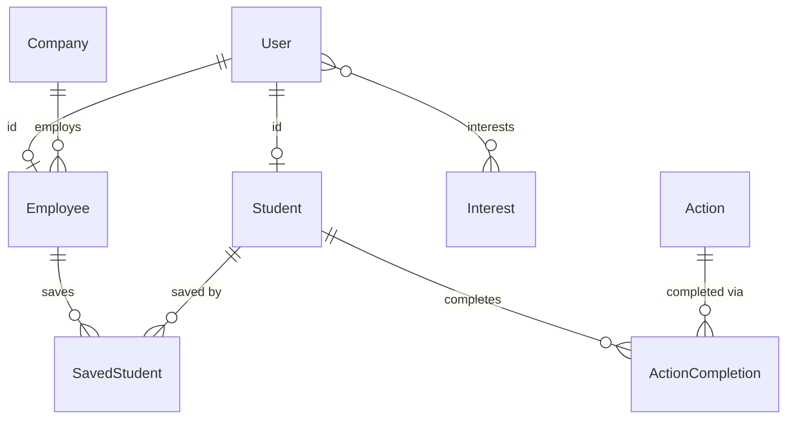

# AGENTS.md

Reference for AI agents (and humans) working in this repo. `README.md` covers local setup; this file covers workflow, stack, layout, conventions, and gotchas that aren't obvious from reading one file.

---

## Contribution workflow

For every requested task:

1. Create a new branch from `dev` named `<type>/<short-kebab-case-description>`, following the [Conventional Branch](https://conventionalbranch.org/) spec. Pick the type that matches the change — don't default everything to `chore/`:
   - `feature/` or `feat/` — new functionality
   - `bugfix/` or `fix/` — bug fixes
   - `hotfix/` — urgent production fixes
   - `release/` — release preparation
   - `docs/` — documentation-only changes (README, `docs/`, AGENTS.md, code comments) — a project-specific addition, not part of the base Conventional Branch spec
   - `chore/` — other non-code tasks (config, deps, tooling)
2. Commit using [Conventional Commits](https://www.conventionalcommits.org/) (`fix:`, `feat:`, `chore:`, `refactor:`, `docs:`, `test:`, `build:`, ...), with these rules:
   - No AI co-author trailer (no `Co-Authored-By` line) on any commit.
   - Subject line under 72 characters.
   - If a task touches multiple unrelated concerns, split the work into separate, logically-scoped commits instead of one bulk commit.
3. Push the task branch to the remote repository.
4. Create a pull request from the task branch into `dev`, never `main`.

---

## Stack

| Layer | Tech |
|---|---|
| Framework | Next.js 15 (App Router), React 18 |
| Language | TypeScript (`strict: true`) |
| Styling | Tailwind CSS 4, HeroUI 2.8 |
| Database | PostgreSQL via Supabase, Prisma 6 (`prisma/schema.prisma`) |
| Auth | Supabase Auth (session) — see [Auth model](#auth-model) |
| Storage | Supabase Storage (avatars: public bucket, CVs: private bucket) |
| Validation | Zod, schemas in `src/schemas/` |
| Package manager | pnpm (see `packageManager` in `package.json`) |
| Deploy | Docker → Coolify |

## Common commands

```bash
pnpm dev          # Next.js dev server (localhost:3000)
pnpm build        # production build
pnpm lint         # eslint .
pnpm typecheck    # next typegen && tsc --noEmit
pnpm generate     # prisma generate (also runs on postinstall)
pnpm migrate      # prisma migrate dev — diffs schema, writes + applies a new migration
pnpm migrate:deploy   # prisma migrate deploy — applies pending migrations, no prompts
pnpm seed         # prisma db seed
pnpm test         # vitest run
pnpm test:watch   # vitest
pnpm wipe -- --confirm   # wipe the DB — only runs when NODE_ENV=development
```

`pnpm test` auto-discovers `*.test.ts` and `*.test.tsx` files with Vitest, including `tests/e2e/` (still just deploy-config smoke tests today, e.g. `dockerBuildArgs.test.ts` checking every `NEXT_PUBLIC_*` var declared in `env.client.ts` is actually wired through the Dockerfile/docker-compose build args — the same gap that caused both the `NEXT_PUBLIC_BASE_URL` and `NEXT_PUBLIC_LOGS_DASHBOARD_URL` incidents). Current coverage includes application boundaries/services, domain value objects, edition action rules, auth flow (including the QR/action-scan token sign-and-verify round trip and the student profile page's ownership check), saved-student comments, logger/Sentry privacy, ISEP email normalization, and component smoke tests. Schema changes go through **Prisma Migrate** (`prisma/migrations/`), not `db push` — a baseline migration (`20260712000000_init`) captures the pre-migration schema; run `pnpm migrate --name <description>` for local changes and commit the generated migration folder. `db push` is no longer the working path; see README's Database Workflow section for the one-time baseline-resolve step needed on any environment whose tables predate the migration history.

## Architecture

### Current layout (`src/`)

```
app/            # Next.js App Router: route groups (auth)/(admin)/(guest)/(profiles) + api/** — routes stay thin, delegating to application/
application/    # service + repository layers: services/ (orchestration, "server-only"), repositories/ (Prisma access) — pure domain rules live in top-level domain/, not here
client/         # client-safe fetch wrappers (e.g. client/api/session.ts) built on lib/http/client.ts's httpClient, "client-only"
components/     # components/ui/ holds shared, reusable primitives (Icons.tsx, Input, Modal, buttons, ...); everything else — reusable or single-use — stays flat at the top level, one PascalCaseName/index.tsx folder each
config/         # static config object (cookies, upload limits), api.ts (client BASE_URL) + env.server.ts/env.client.ts (Zod-validated env) — edition content now lives in edition/, not here
contexts/       # React contexts
domain/         # pure business rules, no I/O, grouped by entity/concern: action/, auth/, company/, savedStudent/, student/
edition/        # single source of truth for per-event content still hardcoded: tier company lists, branding, actions.ts (action names + booth-to-action mapping) — Sponsors, FAQ, and the schedule/timetable moved to the DB (Sponsor/FaqEntry/ScheduleEvent models, admin CRUD + drag-and-drop reorder boards for FAQ/schedule), don't add any of them back here
hooks/          # React hooks
lib/            # remaining server + shared helpers not yet moved into application/ (logger, Sentry privacy, file signatures, saved-student comment formatting) + http/ (client.ts's HttpClient, server.ts's defineHandler)
schemas/        # Zod input validation
types/          # shared TypeScript types
utils/          # generic helpers only now (date, files, canvas, isepEmail, Supabase client factories) — edition content was moved out to edition/
```

`tests/e2e/` is reserved at the repo root (outside `src/`) for future integration/smoke tests — existing unit tests stay colocated with the code they cover, don't move them there.

**Layer boundary:** `application/repositories/` is the only place that should query through the Prisma client (i.e. call `prisma.*` at runtime) — type-only imports from `@prisma/client` (e.g. `import type { Tier } from "@prisma/client"` in components/types/services) are fine elsewhere and aren't a boundary violation. `application/services/` orchestrates repositories and domain rules and is marked `"server-only"`; top-level `domain/` holds pure business rules with no I/O, grouped by entity/concern (e.g. `domain/auth/authPolicy.ts`'s `passesAuthPolicy` is the predicate `defineHandler`'s auth Strategy is built on). `client/` holds browser fetch wrappers marked `"client-only"`, built on `lib/http/client.ts`'s `httpClient`. `lib/` is what's left after that split — check the top of a file (`"server-only"`, `"client-only"`, or a Prisma/Supabase-server import) before assuming a function's execution context; the migration to `application/`/`client/` isn't total yet.

**HTTP layer:** `lib/http/` is the two-sided extraction of the old inline `auth → parse → work → respond → error-map` per route. `lib/http/server.ts` (`"server-only"`) exports `defineHandler({ auth, schema?, authorize?, handler })`: `auth` is a Strategy (`"public" | "session" | "student" | "employee" | "admin"`, default `"session"`) resolved against the current session by `passesAuthPolicy`; `schema` is an optional Zod schema whose parsed body lands in `handler`'s `body` (a thrown `ZodError` is mapped to `{ error: issues }`/400 by `httpErrorResponse`, same as any thrown `HttpError`/unknown error); `authorize` is an optional `(session, params) => boolean` for ownership checks (e.g. `session.student?.code === params.code`) that runs after the auth Strategy passes. `lib/http/client.ts` (`"client-only"`) exports `httpClient`, a `FetchHttpClient` implementing the `HttpClient` interface (`get`/`post`/`patch`/`put`/`delete`, JSON in/out, throws a typed `HttpClientError` — with `.status` — on a non-2xx response) plus a `raw()` escape hatch for blob/redirect responses that don't fit the JSON contract (e.g. CSV/zip exports). New routes and new client fetch call sites should go through these instead of hand-rolled session checks or raw `fetch`. See `src/app/api/saved/route.ts` (multiple auth Strategies + `authorize` + schema in one file) and `src/client/api/session.ts` (a `try`/`catch HttpClientError` around a call whose non-2xx response — no session — is an expected outcome, not a failure) for the current pattern. Not every route fits: a hot liveness-probe path that shouldn't pay for a session lookup (`health`), and multipart/form-data uploads (`storage/avatar`, `storage/cv` — `schema` only parses JSON) stay as plain route exports; each says why in a comment. Don't put Prisma calls or business rules directly in a route file — add or extend a repository/service instead.

### Data model

Prisma models: `User` (1:1 `Student` or `Employee`, both keyed by the same `id` as `User`), `Student`, `Company` (has `tier`: DIAMOND/GOLD/SILVER/BRONZE), `Employee` (belongs to `Company`), `Action` / `ActionCompletion` (points for QR-scanned actions), `Interest` (many-to-many with `User`), `SavedStudent` (company saves a student).

**`SavedStudent` grain mismatch:** the table's primary key is `[studentId, employeeId]` (employee-scoped), but `isStudentSaved()` in `src/application/repositories/savedStudentRepository.ts` (exposed as `isSaved()` via `src/application/services/savedStudentService.ts`) checks `savedBy: { companyId }` — i.e. the app-level dedup rule is company-scoped while the DB constraint is employee-scoped. Two employees at the same company can currently save the same student twice. Don't assume the DB enforces what the app-level check assumes.



## Auth model

Two independent mechanisms — don't conflate them:

- **Session auth (login state):** Supabase Auth. `getServerSession()` (`src/application/services/sessionService.ts`) reads the Supabase session via `supabase.auth.getUser()`, then looks up the corresponding Prisma `User` (student or employee profile). Client-side equivalent is `getSession()` in `src/client/api/session.ts`, which hits `src/app/api/auth/session/route.ts`.
- **Short-lived action tokens:** hand-rolled JWTs via `jsonwebtoken`, signed/verified in `src/application/services/authService.ts` (`signJwt`/`verifyJwt`, using `serverEnv.JWT_SECRET` from `@/config/env.server` — not raw `process.env`). Used for the student's personal QR code (`src/app/api/qrcode/route.ts`, 30-minute expiry) and temporary student-profile preview access (`jwtStudent()` in `src/application/services/studentTokenService.ts` signs a token embedding the student `code`, 15-minute expiry; `src/app/(profiles)/student/[...data]/page.tsx` verifies it via `verifyJwt` when the route's `preview` segment is set — used by the company-facing QR and saved-profile flows to grant time-limited profile access within an existing authenticated session, without requiring the profile to be saved) — all genuinely short-lived. **Action QR codes** (`getActionQrCode()` in `src/application/services/actionService.ts`) used to be an exception — a units bug passed a millisecond value straight into `jsonwebtoken`'s numeric `expiresIn` (interpreted as seconds), so the token actually lived ~8.3 hours instead of the intended 30 seconds; fixed in #212, with a regression test asserting `expiresIn: 30` colocated in `actionService.test.ts`. None of these are for login sessions.
- `authService.ts` also exports `hashPassword`/`comparePassword`/`validatePassword` (bcrypt). These are currently **unused dead code** — no route calls them. Don't assume there's a bcrypt-based credential path; all real login goes through Supabase.
- Password resets are self-service only: `src/app/(auth)/password-reset/page.tsx` posts an email to `src/app/api/auth/password-reset/route.ts`, which calls Supabase's `resetPasswordForEmail` (PKCE flow, verifier persisted in cookies) with a redirect to `/password-reset/confirm`. The confirm page (`src/app/(auth)/password-reset/confirm/page.tsx`) then calls `supabase.auth.updateUser({ password })` directly from the browser client using the session Supabase restored from the PKCE callback — there is no server route for the confirm step. The old admin-reset-another-user's-password route (`src/app/api/auth/password-change/route.ts`) has been removed; `changePassword()` still exists in `src/application/services/authApplicationService.ts` but is currently **unused dead code** — no route calls it. Don't add a third path — extend the self-service flow, or wire `changePassword()` up if an admin-reset route is genuinely needed again.

## Conventions

- **Validation:** new request validation goes in `src/schemas/` as a named Zod schema, imported by the route — don't add another inline `z.object(...)` in a route file.
- **Route responses:** always pass an explicit status code to `NextResponse.json(body, { status })`. The default is 200, and some existing routes rely on that default even for validation/auth failures — don't copy that pattern in new code.
- **`app/auth/confirm/route.ts`** lives outside the `(auth)`/`api` conventions on purpose — it's the Supabase email-confirmation callback URL, which Supabase itself constructs, so it can't move without reconfiguring Supabase. Leave it where it is.
- **Edition-specific content** still hardcoded (tier company lists, booth-to-action mapping, branding) is centralized under `src/edition/` — `edition/actions.ts` holds `actionNames` and the `getBoothActionName()` lookup that `savedStudentService.saveStudent()` calls instead of an inline `switch`. When editing that content for a new event, change `edition/`, not `config/` or `utils/`. Sponsors, FAQ, and the schedule/timetable are DB-backed instead (`Sponsor`/`FaqEntry`/`ScheduleEvent` models), editable through the admin backoffice — don't add a static `edition/` file for any of them.
- **Env vars:** validated through Zod, not read from `process.env` directly. Server-only secrets/config go through `serverEnv` (`src/config/env.server.ts`, guarded by `server-only`, validated lazily on first property access); `NEXT_PUBLIC_*` vars go through `clientEnv` (`src/config/env.client.ts`, validated eagerly at import time, since Next.js inlines them into the browser bundle at build time). Import whichever matches where your code runs — don't add a new raw `process.env.*` read. `.env.example` is the source of truth for required keys; keep it in sync with both schemas when you add or rename one.
- **Components:** every component gets its own `PascalCaseName/index.tsx` folder. Shared, reusable primitives go in `components/ui/` (e.g. `Icons.tsx`, `Input`, `Modal`, `PrimaryButton`); everything else — reusable feature composites or single-use page sections alike (e.g. `Companies`, `Profile`, `GiveawaySection`, `AdminSavedSection`) — stays at the top level of `components/`, following the same pattern. There is no route-local `_components/` convention in use — keep new components in `components/` rather than colocating them under `app/`.
- **Where new code goes:**

  | Kind of code | Goes in |
  |---|---|
  | Prisma/DB access | `application/repositories/` |
  | Orchestration (multi-repo calls, external services) | `application/services/` (mark `"server-only"`) |
  | Pure business rule, no I/O | `domain/<entity-or-concern>/` (camelCase folder) |
  | Browser fetch wrapper | `client/api/` (mark `"client-only"`, built on `lib/http/client.ts`'s `httpClient`) |
  | Zod validation schema | `schemas/` |
  | Static/env config | `config/` |
  | Per-edition content still hardcoded (tier company lists, branding) | `edition/` |
  | Generic helper (date, files, canvas) | `utils/` |
  | Shared UI primitive | `components/ui/` |
  | Any other component, reusable or single-use | top level of `components/` |
  | Integration/smoke test | `tests/e2e/` (unit tests stay colocated) |
- **API error responses:** shapes are inconsistent across existing routes (`{ error }`, `{ message }`, raw Zod `e.errors`/`e.issues`/`.error`, English and Portuguese strings all appear). For **new** routes, standardize on `{ error: string }` for failures (the majority pattern) with an explicit status code every time — don't add another one-off shape, and don't rely on the 200 default (a few existing routes do this on validation/auth failure; that's a known bug, not a pattern to copy).

## Editions & releases

Each yearly edition is tracked as a git tag + GitHub Release on this one persistent repo (no more forking a new repo per edition) plus a hand-written `CHANGELOG.md` entry — not generated from Conventional Commits, since this ships once a year for a small team.

- **Tag name:** `<year>-edition` (e.g. `2025-edition`, `2026-edition`).
- **Source archive:** GitHub auto-generates a "Source code (zip/tar.gz)" download for every tag/release — that's the frozen, downloadable artifact for a past edition. This is a dynamic Next.js + Postgres app, not a static site, so the archive is source only: running it still needs your own Postgres, a Supabase project, and the usual local setup in `README.md`. No Docker image is published per edition at this time — the source tag is the deliverable (see `CHANGELOG.md` for what changed each edition).
- **Versioning resets per edition:** a freshly-cut edition's `CHANGELOG.md` entry/release starts at `1.0.0`; further within-edition maintenance (fixes, restructuring, hygiene) increments from there (`1.0.1`, `1.1.0`, ...) until the *next* edition's cutover restarts the count at `1.0.0`. Editions are distinguished by the `<year>-edition` tag, not by a version number that climbs forever across editions.
- The 2026 edition's own `1.0.0` cutover happens once the current backlog of open architecture/security/correctness issues is merged to `main`.

## Verification (definition of done)

CI (`.github/workflows/ci.yml`) runs `pnpm test`, `pnpm typecheck`, and `pnpm lint` on every PR, and `next build` also fails on type/lint errors. Before considering a task done:

1. Run `pnpm lint` and fix anything it flags in touched files — this also runs in CI, but don't wait for CI to tell you.
2. Run `pnpm test` — keep it green, and extend the relevant test file when behavior changes. CI reruns the full auto-discovered suite.
3. Run `pnpm typecheck` — this also runs in CI, but don't rely on CI alone to catch it.
4. Start `pnpm dev` and actually exercise the changed behavior — hit the changed route/page, not just read the diff. For an API route: call it (browser/curl) and check the actual response body *and* status code. For UI: load the page and interact with the changed flow.
5. Do not report a task as complete on the basis of "it compiles" or "lint passed" alone — those are necessary, not sufficient. State plainly if something couldn't be verified this way (e.g. requires a real Supabase session, a QR scan, or an external service) rather than implying it was checked.

## Gotchas

- **`pnpm test` uses Vitest auto-discovery** for `*.test.ts` and `*.test.tsx`, and CI runs the suite on every PR. Add colocated tests without maintaining a central file list; still verify changed runtime flows manually where unit tests don't cover them.
- **`prisma/wipe.ts` is destructive** (`pnpm wipe -- --confirm`) and only runs when `NODE_ENV` is exactly `development` — it refuses in any other environment (including staging or a non-`development` test setup, not just `production`) — double-check `DATABASE_URL` and `NODE_ENV` before running it anywhere but local.
- **PWA is enabled** (`@ducanh2912/next-pwa`) — changes to caching behavior or service-worker-adjacent routes should be checked on a real device/PWA install, not just the dev server.
- **CSP is not yet configured** in `next.config.js`'s `headers()` — only the baseline headers (`Strict-Transport-Security`, `X-Content-Type-Options: nosniff`, `X-Frame-Options: SAMEORIGIN`, `Referrer-Policy`, `Permissions-Policy`) are set. Don't assume a `Content-Security-Policy` or CSP `frame-ancestors` directive exists.
- **QR action codes have no dedicated anti-replay/nonce check** in `src/app/api/actions/[id]/route.ts` beyond the JWT's own `exp` claim — since #212 fixed that claim to actually be ~30 seconds (see [Auth model](#auth-model)) rather than ~8.3 hours, a captured/screenshotted code is only replayable within that ~30s window (e.g. showing it to another student before it expires), not indefinitely. Still worth knowing before assuming stronger replay protection exists than this.
