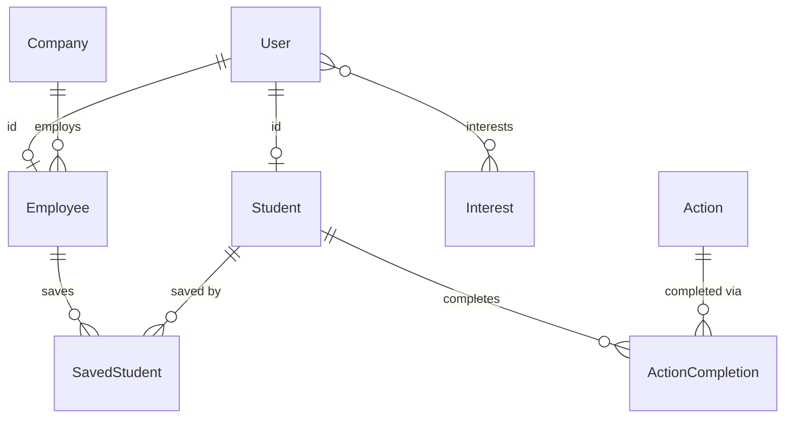

# AGENTS.md

Reference for AI agents (and humans) working in this repo. `README.md` covers local setup; this file covers workflow, stack, layout, conventions, and gotchas that aren't obvious from reading one file.

---

## Contribution workflow

For every requested task:

1. Create a new branch from `dev` named `<type>/<short-kebab-case-description>`, following the [Conventional Branch](https://conventionalbranch.org/) spec. Pick the type that matches the change — don't default everything to `chore/`:
   - `feature/` or `feat/` — new functionality
   - `bugfix/` or `fix/` — bug fixes
   - `hotfix/` — urgent production fixes
   - `release/` — release preparation
   - `chore/` — non-code tasks (docs, config, deps, tooling)
2. Commit using [Conventional Commits](https://www.conventionalcommits.org/) (`fix:`, `feat:`, `chore:`, `refactor:`, `docs:`, `test:`, `build:`, ...), with these rules:
   - No AI co-author trailer (no `Co-Authored-By` line) on any commit.
   - Subject line under 72 characters.
   - If a task touches multiple unrelated concerns, split the work into separate, logically-scoped commits instead of one bulk commit.
3. Push the task branch to the remote repository.
4. Create a pull request from the task branch into `dev`, never `main`.

---

## Stack

| Layer | Tech |
|---|---|
| Framework | Next.js 15 (App Router), React 18 |
| Language | TypeScript (`strict: true` — see [Gotchas](#gotchas) for what still slips through anyway) |
| Styling | Tailwind CSS 4, HeroUI 2.8 |
| Database | PostgreSQL via Supabase, Prisma 6 (`prisma/schema.prisma`) |
| Auth | Supabase Auth (session) — see [Auth model](#auth-model) |
| Storage | Supabase Storage (avatars: public bucket, CVs: private bucket) |
| Validation | Zod, schemas in `src/schemas/` |
| Package manager | pnpm (see `packageManager` in `package.json`) |
| Deploy | Docker → Coolify |

## Common commands

```bash
pnpm dev          # Next.js dev server (localhost:3000)
pnpm build        # production build
pnpm lint         # eslint .
pnpm typecheck    # next typegen && tsc --noEmit
pnpm generate     # prisma generate (also runs on postinstall)
pnpm migrate      # prisma migrate dev — diffs schema, writes + applies a new migration
pnpm migrate:deploy   # prisma migrate deploy — applies pending migrations, no prompts
pnpm seed         # prisma db seed
pnpm test         # tsx --test src/lib/logger.test.ts src/lib/sentryPrivacy.test.ts
pnpm wipe -- --confirm   # wipe the DB — only runs when NODE_ENV=development
```

`pnpm test` exists but coverage is minimal (two files) — see [Gotchas](#gotchas). Schema changes go through **Prisma Migrate** (`prisma/migrations/`), not `db push` — a baseline migration (`20260712000000_init`) captures the pre-migration schema; run `pnpm migrate --name <description>` for local changes and commit the generated migration folder. `db push` is no longer the working path; see README's Database Workflow section for the one-time baseline-resolve step needed on any environment whose tables predate the migration history.

## Architecture

### Current layout (`src/`)

```
app/            # Next.js App Router: route groups (auth)/(admin)/(guest)/(profiles) + api/**
components/     # ~60 folders, flat mix of reusable primitives and one-off page sections
config/         # static config object (cookies, upload limits, action names) + env.server.ts/env.client.ts (Zod-validated env)
contexts/       # React contexts
hooks/          # React hooks
lib/            # data-access functions — MIXED: some are server-only (Prisma), some are client fetch wrappers
schemas/        # Zod input validation (partially adopted — some routes still inline z.object)
services/       # MIXED: session/auth helpers (server) + HTTP client helpers (client) live side by side
styles/         # currently just Icons.tsx
types/          # shared TypeScript types
utils/          # MIXED: real helpers (date, files, canvas) + edition content (Sponsors, Companies, FAQ, ScheduleDays)
```

**The load-bearing fact:** `lib/` and `services/` each currently mix server-only code (touches Prisma or Supabase service-role) with client-safe code (browser `fetch`) in the same folder, with no naming rule distinguishing them. Check the top of a file for `import prisma from "@/lib/prisma"` or a Supabase server client before assuming a function is safe to call from a Client Component.

**Route handler shape today:** routes do everything inline (auth check → validate → Prisma call → respond) in one file, e.g. `src/app/api/students/route.ts`. Follow the existing per-file pattern; there is no separate service/repository layer to call into yet.

### Data model

Prisma models: `User` (1:1 `Student` or `Employee`, both keyed by the same `id` as `User`), `Student`, `Company` (has `tier`: DIAMOND/GOLD/SILVER/BRONZE), `Employee` (belongs to `Company`), `Action` / `ActionCompletion` (points for QR-scanned actions), `Interest` (many-to-many with `User`), `SavedStudent` (company saves a student).

**`SavedStudent` grain mismatch:** the table's primary key is `[studentId, employeeId]` (employee-scoped), but `isSaved()` in `src/lib/savedStudents.ts` checks `savedBy: { companyId }` — i.e. the app-level dedup rule is company-scoped while the DB constraint is employee-scoped. Two employees at the same company can currently save the same student twice. Don't assume the DB enforces what the app-level check assumes.



## Auth model

Two independent mechanisms — don't conflate them:

- **Session auth (login state):** Supabase Auth. `getServerSession()` (`src/services/getServerSession.ts`) reads the Supabase session cookie, looks up the corresponding Prisma `User`. Client-side equivalent is `src/services/getSession.ts`.
- **Short-lived action tokens:** hand-rolled JWTs via `jsonwebtoken`, signed/verified in `src/services/authService.ts` (`signJwt`/`verifyJwt`, using `serverEnv.JWT_SECRET` from `@/config/env.server` — not raw `process.env`). Used for QR action codes (`src/app/api/qrcode`, `src/app/api/actions/[id]`) and temporary student-profile preview access (`jwtStudent()` in `src/lib/jwtStudent.ts` signs a token embedding the student `code`, 15-minute expiry; `src/app/(profiles)/student/[...data]/page.tsx` verifies it via `verifyJwt` when the route's `preview` segment is set — used by the company-facing QR and saved-profile flows to grant time-limited profile access within an existing authenticated session, without requiring the profile to be saved) — both genuinely short-lived. **CV export links** (`src/app/api/export`) use the same mechanism but are an exception: `signJwt` is called with no `expiresIn`, so the token is intentionally **non-expiring** for now, pending an open retention-policy decision (see the code comment in `export/route.ts`) — don't lump it in with the other two as "expiring." None of these are for login sessions.
- `authService.ts` also exports `hashPassword`/`comparePassword`/`validatePassword` (bcrypt). These are currently **unused dead code** — no route calls them. Don't assume there's a bcrypt-based credential path; all real login goes through Supabase.
- Password changes are split across two routes: `src/app/api/auth/password-change/route.ts` (admin-only, session-gated — an admin resets another user's password via the Supabase admin client) and `src/app/api/auth/password-reset/route.ts` (self-service, the Supabase `resetPasswordForEmail`/`exchangeCodeForSession` flow). Don't add a third path — extend one of these two.

## Conventions

- **Validation:** new request validation goes in `src/schemas/` as a named Zod schema, imported by the route — don't add another inline `z.object(...)` in a route file.
- **Route responses:** always pass an explicit status code to `NextResponse.json(body, { status })`. The default is 200, and some existing routes rely on that default even for validation/auth failures — don't copy that pattern in new code.
- **`app/auth/confirm/route.ts`** lives outside the `(auth)`/`api` conventions on purpose — it's the Supabase email-confirmation callback URL, which Supabase itself constructs, so it can't move without reconfiguring Supabase. Leave it where it is.
- **Edition-specific content** (sponsors, tiers, booth-to-action mapping, schedule, FAQ) is hardcoded across `src/utils/*Companies*`, `src/app/api/saved/route.ts`'s booth `switch`, and `src/config/index.ts`'s `actionNames` — these are per-event content, not generic utilities, even though some live in `utils/`.
- **Env vars:** validated through Zod, not read from `process.env` directly. Server-only secrets/config go through `serverEnv` (`src/config/env.server.ts`, guarded by `server-only`, validated lazily on first property access); `NEXT_PUBLIC_*` vars go through `clientEnv` (`src/config/env.client.ts`, validated eagerly at import time, since Next.js inlines them into the browser bundle at build time). Import whichever matches where your code runs — don't add a new raw `process.env.*` read. `.env.example` is the source of truth for required keys; keep it in sync with both schemas when you add or rename one.
- **Components:** `src/components/` is flat — every component, reusable or single-use, gets its own top-level `PascalCaseName/index.tsx` folder (e.g. `Input`, `Modal`, but also one-off sections like `GiveawaySection`, `AdminSavedSection`). There is no `components/ui/` split and no route-local `_components/` convention in use today — put new components at the top level of `components/` following that same pattern rather than inventing a nested structure.
- **API error responses:** shapes are inconsistent across existing routes (`{ error }`, `{ message }`, raw Zod `e.errors`/`e.issues`/`.error`, English and Portuguese strings all appear). For **new** routes, standardize on `{ error: string }` for failures (the majority pattern) with an explicit status code every time — don't add another one-off shape, and don't rely on the 200 default (a few existing routes do this on validation/auth failure; that's a known bug, not a pattern to copy).

## Verification (definition of done)

CI (`.github/workflows/ci.yml`) runs `pnpm typecheck` and `pnpm lint` on every PR, but test coverage is still minimal and CI doesn't run `pnpm test`, and `next build` itself still ignores type/lint errors (see [Gotchas](#gotchas)) — so CI catches type/lint regressions, but most functional breakage still will not be caught automatically. Before considering a task done:

1. Run `pnpm lint` and fix anything it flags in touched files — this also runs in CI, but don't wait for CI to tell you.
2. Run `pnpm test` — keep it green, and extend it if you touch `src/lib/logger.ts` or `src/lib/sentryPrivacy.ts`. CI does not run this for you.
3. Run `pnpm typecheck` — this also runs in CI, but don't rely on CI alone to catch it.
4. Start `pnpm dev` and actually exercise the changed behavior — hit the changed route/page, not just read the diff. For an API route: call it (browser/curl) and check the actual response body *and* status code. For UI: load the page and interact with the changed flow.
5. Do not report a task as complete on the basis of "it compiles" or "lint passed" alone — those are necessary, not sufficient. State plainly if something couldn't be verified this way (e.g. requires a real Supabase session, a QR scan, or an external service) rather than implying it was checked.

## Gotchas

- **`tsconfig.json` now has `strict: true`**, but `next.config.js` still sets `typescript.ignoreBuildErrors: true` + `eslint.ignoreDuringBuilds: true` — `next build` itself will not fail on a type or lint error. CI's separate `pnpm typecheck`/`pnpm lint` job (`.github/workflows/ci.yml`) is what actually gates PRs on these; don't treat a successful `next build` as a signal that types are clean.
- **`pnpm test` exists but is minimal** (`src/lib/logger.test.ts`, `src/lib/sentryPrivacy.test.ts`), and CI doesn't run it. Verify most changes manually (dev server, direct route calls) rather than assuming a gate will catch regressions.
- **`prisma/wipe.ts` is destructive** (`pnpm wipe -- --confirm`) and only runs when `NODE_ENV` is exactly `development` — it refuses in any other environment (including staging or a non-`development` test setup, not just `production`) — double-check `DATABASE_URL` and `NODE_ENV` before running it anywhere but local.
- **PWA is enabled** (`@ducanh2912/next-pwa`) — changes to caching behavior or service-worker-adjacent routes should be checked on a real device/PWA install, not just the dev server.
- **CSP is not yet configured** in `next.config.js`'s `headers()` — only the baseline headers (`Strict-Transport-Security`, `X-Content-Type-Options: nosniff`, `X-Frame-Options: SAMEORIGIN`, `Referrer-Policy`, `Permissions-Policy`) are set. Don't assume a `Content-Security-Policy` or CSP `frame-ancestors` directive exists.
- **QR action codes have an anti-replay check commented out** in `src/app/api/actions/[id]/route.ts` — the rotating-timestamp freshness check is disabled, so a captured QR code can currently be replayed. Don't assume replay protection is active.
